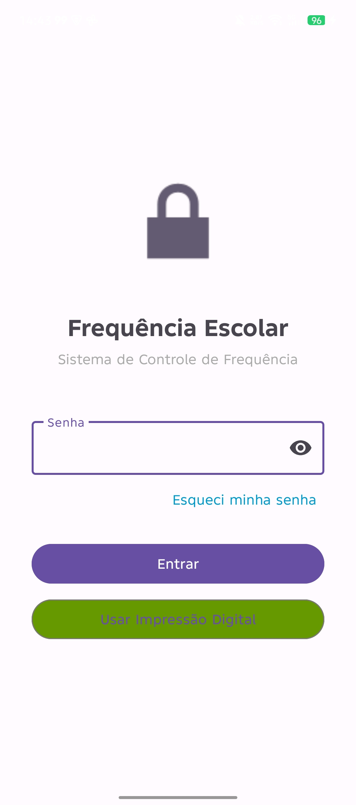
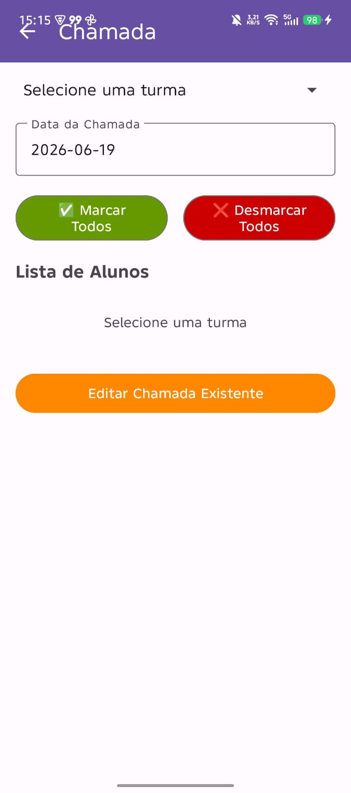
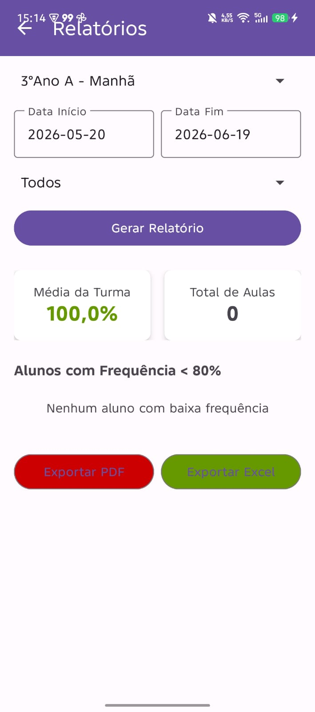
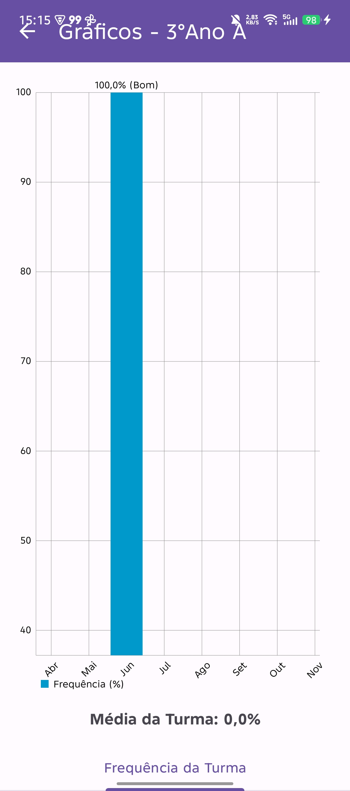
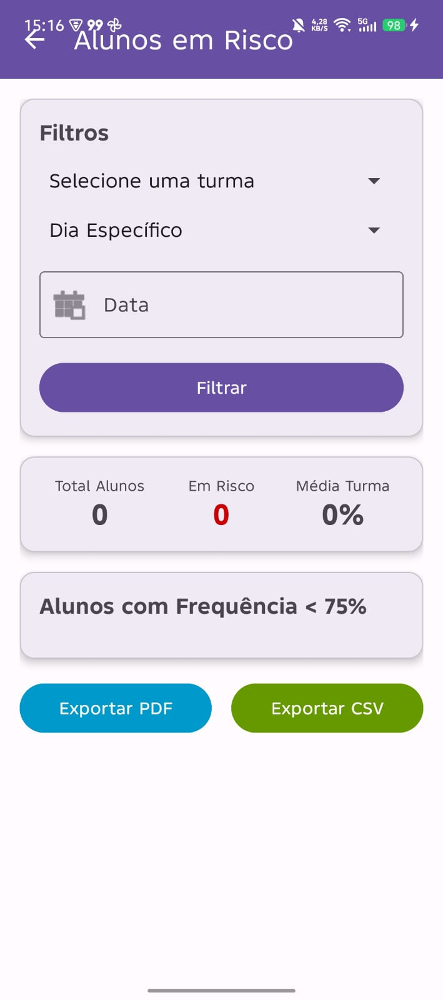

<div align="center">

# 📚 Frequência Escolar — Android

**Sistema de controle de frequência escolar para uso do professor, totalmente offline.**


</div>

---

## 📋 Sobre o Projeto

O **Frequência Escolar** é um aplicativo Android desenvolvido para professores registrarem e acompanharem a frequência dos alunos de forma simples, rápida e completamente offline. Com suporte a múltiplas turmas, relatórios detalhados, gráficos e exportação de dados, ele centraliza toda a gestão de presença escolar em um único lugar.

---
## 📱 Capturas de Tela

| Login | Lista de Turmas | Chamada |
|-------|-----------------|---------|
|  |  |  |

| Relatórios | Gráficos | Alunos em Risco |
|------------|----------|-----------------|
|  |  |  |

## 🛠️ Tecnologias

| Tecnologia | Uso |
|---|---|
| **Java** | Linguagem principal |
| **SQLite + Room** | Banco de dados local |
| **XML + Material Design** | Interface do usuário |
| **AndroidKeyStore** | Criptografia de senha |
| **WorkManager** | Backup automático e notificações |
| **Google Drive API** | Sincronização de backup |
| **MPAndroidChart** | Gráficos de frequência |
| **iText / Apache POI** | Exportação PDF e Excel |

**Mínimo SDK:** API 24 (Android 7.0 Nougat)

---

## 📋 Pré-requisitos

| Ferramenta | Versão mínima |
|---|---|
| Android Studio | Ladybug 2024.2.1+ |
| Java JDK | 17+ |
| Android SDK | API 24+ |
| Git | 2.20+ |

---

## 🚀 Como Instalar

### Opção 1 — Compilar pelo Android Studio

```bash
git clone https://github.com/DouglasLira-Dev/School-Attendance-System.git
```

1. Abra o projeto no **Android Studio**
2. Aguarde o Gradle Sync finalizar
3. Conecte seu celular com **Depuração USB** ativada
4. Clique em **Run** (▶️)

### Opção 2 — Instalar via APK

1. Acesse a seção [Releases](https://github.com/DouglasLira-Dev/School-Attendance-System/releases)
2. Baixe o `.apk` da versão mais recente
3. No celular, permita **instalação de fontes desconhecidas**
4. Instale e abra o aplicativo

---

## ✅ Funcionalidades

### 👥 Gestão de Turmas e Alunos
- CRUD completo de Turmas e Alunos
- Matrícula e transferência entre turmas
- Transferência para outra escola, expulsão e desistência
- Histórico de movimentações do aluno
- Campos opcionais: responsável e telefone

### 📋 Chamada (Registro de Frequência)
- Registro de chamada por turma e data
- Marcação de presença/ausência com switches
- Justificativa de falta (campo opcional)
- Geolocalização no momento da chamada
- Impedimento de chamada duplicada (mesma turma/data)
- Edição de chamada existente (até 30 dias)
- Botões "Marcar Todos Presentes" e "Desmarcar Todos"

### 📊 Relatórios e Estatísticas
- Relatório individual por aluno (histórico completo)
- Relatório consolidado por turma
- Lista de alunos com frequência abaixo de 80%
- Lista de alunos em risco (frequência < 75%)
- Filtros: Dia, Semana, Mês, Bimestre
- Filtro por status do aluno (Ativos, Transferidos, Expulsos)
- Exportação em **PDF** e **CSV/Excel**

### 📈 Gráficos
- Gráfico de barras: frequência da turma por mês
- Gráfico de linha: evolução individual do aluno
- Linha de referência em 80% (mínimo recomendado)

### ⚙️ Configurações
- Seleção de dias letivos por checkbox
- Período letivo (data de início e fim)
- Horário do lembrete de chamada
- Opção de desconsiderar faltas justificadas no cálculo
- Gerenciamento de feriados (com opção recorrente)

### 🔔 Notificações
- Lembrete diário de chamada (configurável)
- Alerta automático de 3 faltas consecutivas
- Alerta de ausência mensal acima de 20%
- Notificações push locais

### 🔐 Segurança
- Login com senha criptografada via AndroidKeyStore
- Autenticação biométrica (impressão digital / Face ID)
- Limite de 5 tentativas de senha (bloqueio de 30s)
- Requisito mínimo: 6 caracteres com letras e números
- Fluxo de "Esqueci a Senha"

### 💾 Backup e Dados
- Backup manual do banco de dados (arquivo `.db`)
- Restauração a partir de arquivo de backup
- Backup automático diário
- Integração com **Google Drive** (upload e restauração)
- Lista de backups com data e tamanho

### 📥 Importação em Massa
- Importação de alunos via arquivo CSV
- Suporte a 2 ou 5 colunas: `Nome`, `Matrícula`, `Responsável`, `Telefone`, `Turma`
- Preview dos dados antes de confirmar
- Validação de matrícula duplicada (mesma turma ou turma diferente)
- Barra de progresso durante a importação
- Download de modelo CSV de exemplo
- Seleção de turma diretamente na tela de importação

### 📱 Experiência do Usuário
- Busca rápida por nome ou matrícula
- Swipe to Refresh nas listas
- Suporte a tablet (layout adaptativo com duas colunas)
- Dark Mode
- Confirmação ao sair sem salvar alterações

---

## 🗂️ Estrutura do Projeto

```
app/src/main/java/com/professor/frequenciaescolar/
├── MainActivity.java
├── data/
│   ├── entities/          # Turma, Aluno, Matricula, Chamada, Presenca, MovimentacaoAluno
│   ├── database/          # DAOs (6) + AppDatabase + FeriadoDao
│   └── repository/        # FrequenciaRepository
├── ui/
│   ├── auth/              # Login, ConfigSenha, EsqueciSenha
│   ├── turmas/            # Lista, Formulário, Adapter
│   ├── alunos/            # Lista, Formulário, Detalhe, Adapter
│   ├── chamada/           # ChamadaActivity, ChamadaAdapter
│   ├── relatorios/        # Dashboard, RelatorioAluno, Adapter
│   ├── graficos/          # BarChart, LineChart, Activity
│   ├── risco/             # AlunosRisco, Adapter
│   ├── backup/            # BackupRestore, Adapter
│   ├── importar/          # ImportarAlunos, PreviewAdapter
│   ├── configuracoes/     # Configuracoes, GerenciarFeriados
│   └── feriados/          # GerenciarFeriadosActivity, FeriadoAdapter
└── utils/
    ├── NotificationHelper.java
    ├── NotificationScheduler.java
    ├── NotificationReceiver.java
    ├── SenhaManager.java
    ├── BackupManager.java
    └── ConfiguracoesManager.java
```

---

## 🗺️ Roadmap

### Próximas melhorias planejadas
- [ ] Top 5 Melhores/Piores Alunos por frequência
- [ ] Tutorial inicial de onboarding
- [ ] Widget na tela inicial do Android
- [ ] Dashboard interativo com gráficos em tempo real
- [ ] Suporte a múltiplos professores/perfis

---

## 📌 Versão Atual

**`v3.2.0`** — Importação com validação de matrícula única

---

## 📜 Histórico de Versões

| Versão | Data | Descrição |
|---|---|---|
| v0.1.0 | 08/06/2026 | Configuração inicial do projeto |
| v0.2.0 | 08/06/2026 | Criação das entidades Room |
| v0.3.0 | 08/06/2026 | Criação dos DAOs (interfaces de acesso) |
| v0.4.0 | 08/06/2026 | AppDatabase e Repository |
| v0.5.0 | 08/06/2026 | CRUD de Turmas (UI) |
| v0.6.0 | 08/06/2026 | CRUD de Alunos e Matrícula |
| v0.7.0 | 08/06/2026 | Tela de Chamada |
| v0.8.0 | 08/06/2026 | Relatórios e Estatísticas |
| v0.9.0 | 08/06/2026 | Notificações e Alertas |
| v1.0.0 | 08/06/2026 | Autenticação Biométrica |
| v1.1.0 | 08/06/2026 | Edição/exclusão de alunos e turmas |
| v1.2.0 | 08/06/2026 | Tela de Configurações |
| v1.3.0 | 08/06/2026 | Relatório por Aluno Individual |
| v1.4.0 | 08/06/2026 | Exportação PDF |
| v1.5.0 | 08/06/2026 | Exportação CSV/Excel |
| v1.6.0 | 08/06/2026 | Gráficos de Frequência |
| v1.6.1 | 08/06/2026 | Campos responsável/telefone opcionais |
| v1.7.0 | 08/06/2026 | Importação em massa de alunos via CSV |
| v1.8.0 | 08/06/2026 | Backup e Restore |
| v1.9.0 | 08/06/2026 | Gerenciamento de Feriados |
| v2.0.0 | 08/06/2026 | Lista de Alunos em Risco |
| v2.1.0 | 08/06/2026 | Exportação Relatório Turma + Swipe |
| v2.2.0 | 08/06/2026 | Exportação real PDF/CSV |
| v2.3.0 | 08/06/2026 | Google Drive e melhorias |
| v2.4.0 | 08/06/2026 | Filtro por status, Widget, Backup auto |
| v2.5.0 | 08/06/2026 | Exportação PDF/Excel real |
| v2.6.0 | 08/06/2026 | Busca rápida + Suporte a tablet |
| v2.7.0 | 08/06/2026 | Marcar todos + Backup automático |
| v2.8.0 | 08/06/2026 | Melhorias de estabilidade e validação |
| v2.9.0 | 08/06/2026 | Esqueci a Senha + Correções de menu |
| v3.0.0 | 08/06/2026 | Melhorias de estabilidade e segurança |
| v3.1.0 | 08/06/2026 | Correções de exportação e chamada |
| **v3.2.0** | **08/06/2026** | **Importação com validação de matrícula única** |

---

## 🤝 Contribuição

Contribuições são bem-vindas! Para contribuir:

1. Faça um **fork** do projeto
2. Crie uma branch para sua feature: `git checkout -b feature/minha-feature`
3. Commit suas alterações: `git commit -m 'feat: adiciona minha feature'`
4. Push para a branch: `git push origin feature/minha-feature`
5. Abra um **Pull Request**

Também sinta-se à vontade para abrir uma **Issue** relatando bugs ou sugerindo melhorias.

---

## 📧 Contato

**Desenvolvedor:** Douglas Lira
**GitHub:** [DouglasLira-Dev](https://github.com/DouglasLira-Dev)

---

## 📄 Licença

Este projeto está sob a licença **MIT**. Veja o arquivo [LICENSE](LICENSE) para mais detalhes.

---

<div align="center">

⭐ Se este projeto te ajudou, considere deixar uma estrela no GitHub!

</div>